# CatFishing

## Summary

Catfishing is a single-player game meant to capture the essence of fishing... and rationality...
Jack, the cat you play as, is sent to an island to pay off his enormous debt and in order to do so he takes up fishing. However, to catch the fish you must
best them in blackjack, some fish more competent than others. Fight powerful adversaries such as clownfish, sea bass, and sharks, and rescue drowning cats in the ocean
to unlock new features to aid in paying off your debt such as leveling up player stats! Remain rational to avoid busting while securing a high hand against your foes,
and budget your earnings towards your powerups, and also your incredible debt. But who says cats in debt can't have nice things? You can spend
some money on cosmetics to improve your island! Make sure to spend responsibly though! Fully pay off your debt to win the game!

## Project Resources

[Web-playable version.](https://lctnguyen.itch.io/catfishing)  
[Proposal](https://docs.google.com/document/d/1TRNl5-x32T2aJ9PQkQaI7YmUFVqYSk3rwORqI4DvXf8/edit?usp=sharing)

## Gameplay Explanation

After getting into the game world, the player should go out to the sea, there the player will see npc that will need their help. The first npc that you save will allow you to sell the fish you capture and also pay off the massive debt. The second npc you rescue will open up a shop where you will purchase upgrades. The third npc you rescue will open up a shop where you can buy decorations.

Now while in the ocean, you should press "F" to fish, after doing the fishing animation you will have to wait a second or two before you get a fish. To catch a fish you just play blackjack. Each rarity of fish has a threshold player must reach in order to catch them.

If you have a good hand that you will know for sure is going to win you the round you can hit the "Double" button during betting phase which will double the bet you placed at the beginning. This pairs very well with the upgrade "Card Peek" which lets you see the fish's hand as you play, allowing you to know what the outcome will be before the round finishes.

During the minigame the world clock will be paused, but as you see the world go into darkness, make sure you go back to the island before you pass out and lose some of your hard earned fish that day. On the island, you can interact with the NPC that you had rescued. They will open up shop, the most important one you have to interact with is the first shop closest to the sea; where you will be able to sell the fishes you have just captured. After selling, your money will increase.

At first try to save up enough to buy the upgrades, and then if you want you can also buy up the decorations. Whilist also trying to save up some money to start buying back your debt little by little.

After you have the upgrades, especially with the purpose of "Card Peek", winning against fishes should be easier; allowing you to work your way towards the 7k debt, which if you do end up getting to, the game will end and Jack will be able to reunite with his friends and family and live happily ever after, he definitely won't try to go back to a casino...

# External Code, Ideas, and Structure

- Provided a lot of good information for how to make good UI in godot and utilizing different godot nodes.
  - [link1](https://youtu.be/5Hog6a0EYa0?si=fGqzHoZAGaBU3IeQ)
  - [link2](https://youtu.be/ftJQdMJa6BI?si=kXGpR2tTRl2boqz)
- [colorblind_filter.gdshader](https://github.com/3yaa/catfishing/blob/08b673dd362266e6993edad63d1630cc84d42b41/scripts/colorblind_filter.gdshader) - AI generated. Used for Material/MaterialShader to change pixel colors based on colorblind mode

# Team Member Contributions

## Loc Nguyen

### Main Role: Level and World Designer

### Day/Night Cycle

Our game includes a day/night cycle to encourage player to return to the island and interact with it. When it is night time, player would not be able to enter the ocean from the island. If they are already in the ocean and it is becoming late, with the inspiration from Stardew Valley, the player would "pass out", get teleported back to the island, and lose half of the fish they are carrying.

- [_Main game clock_](https://github.com/3yaa/catfishing/blob/658e5dfbbf2c341ce6b17bd8107e8072f4b1f74b/scripts/ocean_area.gd#L27): The clock is a `Timer` alternating between 2 different durations for day and night that can be individually adjusted for game feel. For other components that depends on the clock, they can access the signal `clock.cycle_changed` or check the boolean variable `clock.is_day`. It can also be paused, using `pause_clock()` and `resume_clock()`, for cases like when player entering minigame.
- [_One-way barrier_](https://github.com/3yaa/catfishing/blob/658e5dfbbf2c341ce6b17bd8107e8072f4b1f74b/scripts/ocean_area.gd#L27): A barrier that is raised at night when player is on the island, preventing them from entering the ocean while still allowing them to return to the island. It is implemented by enabling/disabling a `CollisionShape2D` depending on the player's position and time logic.
- [_Staying late in ocean_](https://github.com/3yaa/catfishing/blob/658e5dfbbf2c341ce6b17bd8107e8072f4b1f74b/scripts/player.gd#L129): If player hasn't returned by halfway through the night `clock.get_remaining_time() < 0.5 * clock.night_duration`, they will be teleported back to the island and lose some of their fish. For simplicity, they would lose half of the fish in their inventory, which are the ones located at the odd indices for the sense of "randomness". With more time, I wish to make a true random selection with a random amount as well.
- [_Visual_](https://github.com/3yaa/catfishing/blob/658e5dfbbf2c341ce6b17bd8107e8072f4b1f74b/scripts/day_night_theme.gd): The main background is swapped based on day or night. A color filter is also applied through `ColorRect` on top of the game to make other assests in the foreground appear darker at night.

|                                   |                                       |
| :-------------------------------: | :-----------------------------------: |
| 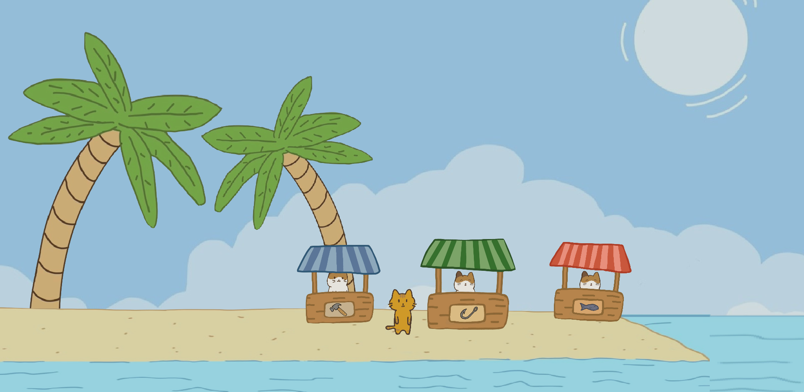 | 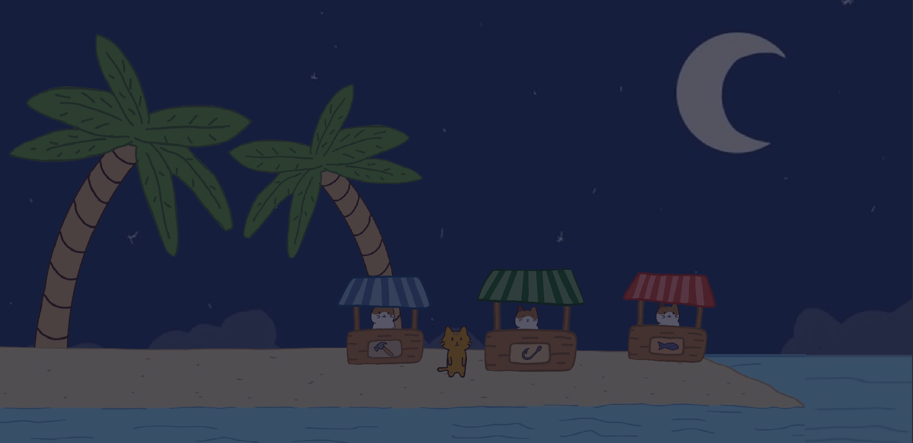 |

### NPCs System

The game includes NPCs that spawn as drowning cats for the player to rescue, after which they would become shopskeepers on the island. This rescuing gameplay was designed to encourage player to go further into the ocean and explore more if the game scales up, giving player more incentive to buy upgrades.

There is a [NPC](https://github.com/3yaa/catfishing/blob/5a17f738dc10ffede2887f316b9a12b835bbd458/scripts/npc/npc.gd) class that each NPC can extend from. NPC is of type `Area2D` to check for player proximity via `_on_body_entered()` before allowing interaction. Player can interact with NPC by pressing the (E) key. Depending on the state `npc.rescued`, the interaction would either be rescuing the NPC or opening up their equivalent shop. This state also determines the NPC's location on the game, the different animations to used, and the dialogue shown to player when they are nearby. An example: [Fish Shop NPC](https://github.com/3yaa/catfishing/blob/5a17f738dc10ffede2887f316b9a12b835bbd458/scripts/npc/npc_fish_shop.gd)

### Shoping System

There are 3 shops in the game. Fish Shop allows player to sell the fish they caught to earn money and pay their debt. Upgrade Shop allows player to buy upgrades to increase their stats. Cosmetic Shop allows player to buy cosmetic items for the island.

(Buttons animation was done by Taef)

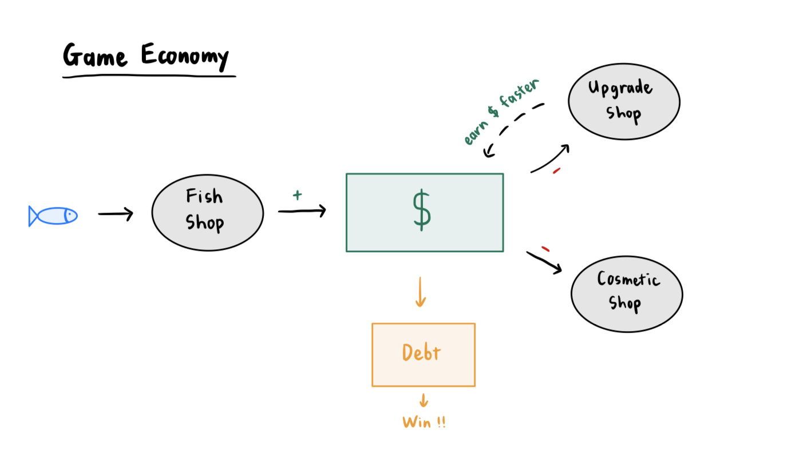

#### Fish Shop

When player opens the shop, they would be able to see the number of fish in their inventory as well as their total value. There is one Sell button that allows player to sell all of their fish at once. In [the selling process](https://github.com/3yaa/catfishing/blob/cce26d3bf1e058d89f71f988fb39006d5b8a7127/scripts/fish_shop_manager.gd#L127), that amount of money would be added to `player.money`, their inventory `fish_logic.fish_inventory` would be cleared, and the display of the shop would be updated.

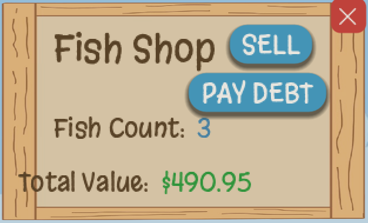

#### Upgrade Shop

In this shop, there are 2 types of upgrades that player can buy: stats upgrades and minigame power-ups. These upgrades are kept track by variables in `player.gd`. Stats upgrades help player with the main game with things like increasing their chance of getting higher quality fish or earning money faster. They are point-based system where player can keep buying to increase their stats. (e.g. [`buy_luck()`](https://github.com/3yaa/catfishing/blob/cce26d3bf1e058d89f71f988fb39006d5b8a7127/scripts/upgrade_shop_manager.gd#L139)) Power-ups are abilities that can be used in the minigame. They are one-time purchases that player can buy to unlock forever. (e.g. [`buy_power1()`](https://github.com/3yaa/catfishing/blob/cce26d3bf1e058d89f71f988fb39006d5b8a7127/scripts/upgrade_shop_manager.gd#L159)). When the shop is opened and after each buy, the [shop display is updated](https://github.com/3yaa/catfishing/blob/cce26d3bf1e058d89f71f988fb39006d5b8a7127/scripts/upgrade_shop_manager.gd#L101) to reflect the latest stats of player. If a power-up is already bought, its button would be disabled and marked as "Owned".

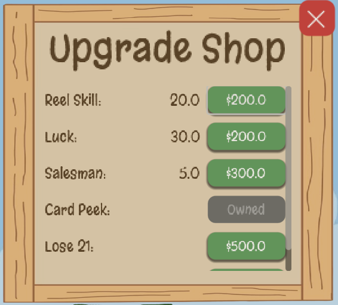

#### Cosmetic Shop

For cosmetic, we decided to use pre-set items because of time constraint. Each item is a `Sprite2D` node that is arranged on the island, all contained within the `Cosmetics` scene. At the start of the game, all of these item would be hidden away. When an item is purchased, its visibility would then be turned on.

### Sub-Role: Accessibility and Usability

The home page contains a settings menu, allowing player to change the volume of the game and select different colorblind modes if needed. I did get help from LLMs to learn about the technical tools that Godot provides and how to set up the setting config file.

- [*Colorblind*](https://github.com/3yaa/catfishing/blob/2cc5065b45e9545554060e1205df30240d0911ec/scripts/colorblind_manager.gd): Player can choose between 4 modes from a [`MenuButton`](https://github.com/3yaa/catfishing/blob/2cc5065b45e9545554060e1205df30240d0911ec/scripts/colorblind_btn.gd): Normal, Protanopia (Red-Blind), Deuteranopia (Green-Blind), and Tritanopia (Blue-Blind). Using `ColorRect`, a filter is applied on top of the game to change its colors depending on the selected mode. I implemented the menu UI and selection logic, while the AI-generated `Shader` is used to calculated the colors.

|                                   |                                       |
| :-------------------------------: | :-----------------------------------: |
| 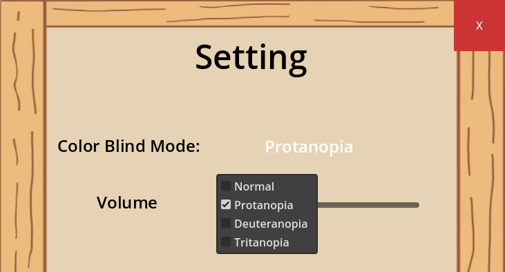 | 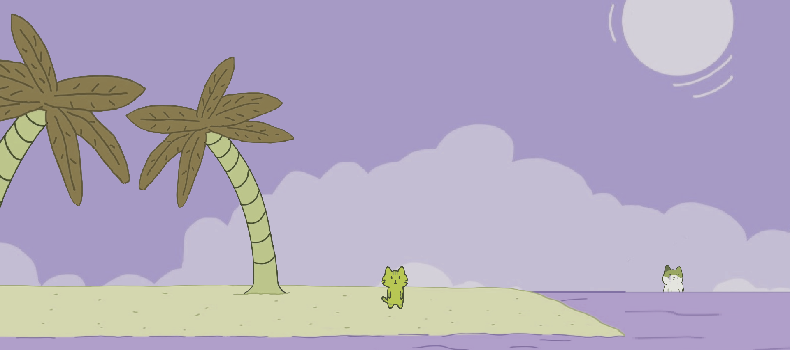 |

- [*Volume Control*](https://github.com/3yaa/catfishing/blob/1076568c5ead1ad071d053cfebbf60a66520566b/scripts/volume_manager.gd): There is a slider that lets player adjust the volume of the game. It uses AudioServer and access the Master bus to adjust the volume with Godot provided functions `set_bus_mute()` and `set_bus_volume_linear()`

- [*Setting Persistence*](https://github.com/3yaa/catfishing/blob/1076568c5ead1ad071d053cfebbf60a66520566b/scripts/settings_manager.gd): Used a autoload script to access and generate a `settings.cfg` file to store the settings preferences of player.

## Jamie Jang

### Main Role: AI and Behavior Designer

### Fish reeling logic:

The fish has three field variables that are essential to its behavior, fish_rarity, size, and value.

fish_rarity:
The fish_rarity is chosen randomly based on a formula:

SUPER_RARE\% + RARE\% + COMMON\% = 100.0,

where the constraints are that:

SUPER*RARE = player.luck\%
RARE = (2 * player.luck)\%
COMMON = [100 - (3 _ player.luck)]\%

The fish rarity formula is bound to the player’s luck stat which can be upgraded to increase the chances of rarer fish appearing. To replicate this optimization problem, we roll a random integer between 1 and 100, and if the roll falls under the thresholds, roll < player.luck\%, roll < player.luck \* 3, and everything else for SUPER_RARE, RARE, and COMMON respectively, that is what it will be assigned to. I used elif statements to ensure the behavior reflects this formula.

reeling:
For the actual reeling, based on the player’s reel_skill, a conditional is used to determine if each instance reeled a fish or not. The conditional used is:
if reel_chance > roll:

roll is just a random float between 0 and 100, so the chance to reel in a fish each interval is roughly player.reel_skill \%. reel_chance is initially the player’s reel_skill at the start of every fishing attempt. However, each interval will increase this chance by 5.0, making it so any subsequent interval should increase the likelihood of reeling a fish in. Upgrading your reel_skill should essentially lead to less intervals passing, meaning that you should have to wait less.

[Reel Logic:](<[(https://github.com/3yaa/catfishing/blob/ee1cbe05b00215d02373b8d100fc9a1afdb8c774/scripts/fish_logic.gd#L29-L76)](https://github.com/3yaa/catfishing/blob/bed68d80eb7c32776e23a9246e994226bfb822a9/scripts/fish_logic.gd#L54-L79)>)

## Fish creation/value logic:

size:
The size is a float that is randomly assigned between size_min and size_max, two variables that never change during runtime.

value:
The value is calculated based on the previous two fields, the rarity and the size. The formulas is as follows:

value = (base*price + size) * player.salesman \_ (rarity + 1)

The base_price refers to just a normal base_price of the fish that can be modified by the developer. This is to ensure that the scalars work as intended. I.e. it would be unreasonable for a common fish with a large size to be more expensive than a very small super rare fish. The size is the base “value” of the fish which is multiplied by two scalars to get the final value. The first scalar, player.salesman is another player stat that determines how much the fish will sell for on top of its size (like bargaining to sell for more). The (rarity + 1) scalar refers to any integer between 1 and 3. The enum Rarity has 3 elements, and to determine the enum randomly, we choose a random integer between 0 and 2. Thus, the scalar would be this random integer + 1 so the rarity scalar would be between 1 and 3. The rarity largely dictates how much rarer the fish truly is.

[Fish Creation Logic:](https://github.com/3yaa/catfishing/blob/ee1cbe05b00215d02373b8d100fc9a1afdb8c774/scripts/fish_logic.gd#L101-L127)

### Blackjack fish AI:

The target score for blackjack is set to max_val, which may change due to powerups/modifiers, and there are also two variables, common_offset and rare_offset. For the purpose of explaining the AI however, please assume that the max_val is 21and the common_offset and rare_offset are 7 and 4 respectively.

Common fish:
The purpose of common fish is to lead to somewhat quick and easy games while
punishing those that keep hitting for high numbers. The common fish has a very simple heuristic where they will keep hitting as long as their sum is < max_val - common_offset, or sum is < 14.The fish should stop hitting once they reach any number greater than 13. This is because in theory, the average sum of two randomly drawn cards is around 14.6~, so the objective is for common fish to stop hitting a little under this value at 14 .This will allow the fish to produce hands ranging from 14-21 This allows for the fish to hit higher values as well as low values. This should teach the player that always aiming for 21 is not the answer; this will lead the player to consistently bust and lose the fish. Instead, the strategy should be to aim for moderately high values between 18-21.

For example, if the fish’s initial sum of its hand is 13:

[A, 2, 3, 4, 5, 6, 7, 8] → Safe, sum between 14-21
[9, 10] → Bust, sum between 22-23

The idea is that the common fish should usually be safe from a bust, so if a player is too ambitious and hits on higher numbers, they may lose rounds that they would have won if they stood instead.

The general strategy for common fish would be to try and play it safe; don't get too greedy but don't be too conservative. You should aim for a moderately high number (15+). There should be tweaks to this strategy based on the card that you can see from the fish (for example if
they have an ace (1/11) you may want to aim for higher numbers as usual (18+).

Rare fish:
The purpose of rare fish is to introduce a difficulty that common fish are unable to bring. The rare fish also follows a simple heuristic, keep hitting as long as their sum is < max_val - rare_offset, which is sum < 17. This is because the possible hands choices for an initial sum of 16 would lead to this outcome:

[A, 2, 3, 4, 5] → Safe, sum between 17-21
[6, 7, 8, 9, 10] → Bust, sum between 22-26

This should yield a roughly 50\% chance for a safe or a bust. Because there is no replacement, it is not exactly 50\% but it should hover around that value. This strategy may lead to more overall busts from the rare fish, but it should produce higher values on average.
Despite the fish busting more frequently, it should force the player to play more aggressively, as playing too passively would result in them consistently losing.

The general strategy against the rare fish should be to try and aim for relatively high numbers (17-21) so that in the case the fish does indeed hit, they will either bust or have a sum less than your final sum.

Super rare fish:

This is the hardest difficulty for the fish, and they will be able to see the player’s hand, giving them a major advantage. The super rare fish is going to be largely luck-based to win against, as they will ALWAYS hit so long as their score is less than yours. Their objective is to force a draw or win.
For example, say the player’s sum is 20 and the fish’s initial sum is 10. Some permutations that would lead to the fish’s victory include (but are not limited to):

[(A), (2, 9), (3, 8), (4, 7), (5, 6), (3, 3, 5), (4, 2, 5), (4, 4, 2, 1), (2, 2, 2, 2, 3), …]

The idea is that this fish should have a wide variety of options available to them due to the various permutations that would lead them to 21. Hence, the player should aim to get a high sum as frequently as possible.

However, if the player’s sum is 20 and fish’s initial sum is 19:

[(A), (A, A), (2)]

The fish’s victory conditions are far smaller than before, so they are more than likely to bust. As mentioned before, the average hand has a sum of 14.6~, so although the fish has an advantage, hitting every time will be a matter of luck as opposed to skill.

The general strategy against the Super Rare fish is to have a high sum (19-21), so if the fish does not initially have a larger sum than your final hand, there will be a greater chance that the fish will bust trying to surpass your score.

[Blackjack Logic](https://github.com/3yaa/catfishing/blob/ee1cbe05b00215d02373b8d100fc9a1afdb8c774/scripts/minigame/blackjack.gd#L104-L155)

#### Behavior Tree:

Reeling Logic:

Common Fish Behavior:
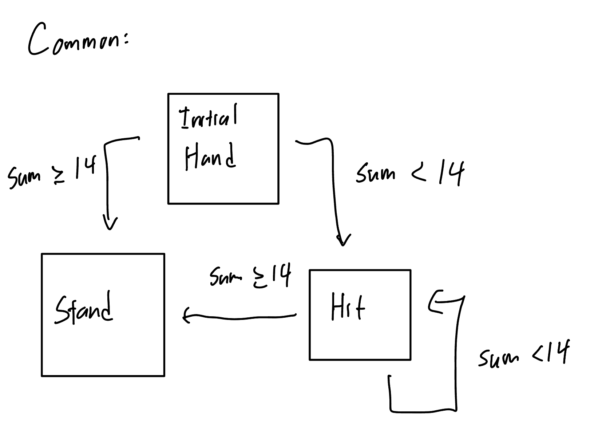

Rare Fish Behavior:
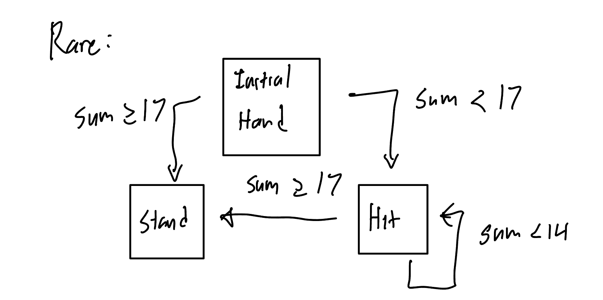

Super Rare Fish Behavior:

#### Tuning

fish_logic.gd:
size_min, size_max, they can be changed to any float so long as size_min < size_max.
base_price, it is the base price of any fish, this can be changed to any float so long as the decimal points are to the hundredths place.
fishing_cooldown is the intervals between each “check” to see if the fish was reeled in

[Variables](https://github.com/3yaa/catfishing/blob/ee1cbe05b00215d02373b8d100fc9a1afdb8c774/scripts/fish_logic.gd#L9-L13)

### Sub-Role: Player Onboarding and Tutorial Design

Documentation for Sub-Role

### Tutorial Design:

The tutorial starts in the beginning, and it should walk the player through the basic core mechanics. The player should walk to the ocean, and save a cat who will later buy your fish for money used for progression. Then, the player should learn to fish, which will prompt a minigame when a fish “bites.” The minigame is blackjack, and the basic rules and features will be explained to the player. After successfully catching the fish (or failing to catch the fish, the result is unimportant), the player will be told that during night, the player must return back to the island. Once the player is back on the island, they will be prompted to talk to the cat that they saved earlier and can sell the fish by interacting with the NPC. This should mark the end of the tutorial, it covers the core mechanics: movement, fishing, rescuing npcs, blackjack, and progression. There are intentionally “unexplored” aspects of the game such as the uses of money, (which will later be revealed to upgrade skills or buy cosmetics from NPCs). This was done to give the player some freedom to discover the game as well. Showing everything in the tutorial may discourage the player to explore and enjoy the game; ending on somewhat of a cliffhanger intends to motivate the player to explore the game to find other aspects.

The tutorial itself is largely based on signal logic, with signals being awaited and button presses (or other conditions) emitting completion signals. Most of the tutorial can be progressed through by pressing the interact button “E” which will emit the respective signal and continue. Some other conditions may be pressing other buttons such as the fishing button or awaiting the player to reach the ocean or land.

The learning curve in general should not be very high, which is also why the tutorial is intentionally on the shorter side to reflect this.

[Tutorial](https://github.com/3yaa/catfishing/blob/ee1cbe05b00215d02373b8d100fc9a1afdb8c774/scripts/tutorial_manager.gd#L32-L188)

### Hint Design:

There will be random hints after the tutorial on the top of the screen to explain some unintuitive facts about the game, especially features (such as stat upgrades and what each stat does) that are introduced after the tutorial. These were moved to hints instead of being integrated into the tutorial to avoid redundancy and give the player the chance to explore and learn more about the game themselves. The hints should try and offset the omission of features from the tutorial. Things that may seem unintuitive to players should eventually be revealed to them in the form of hints.

The hints should appear for 10 seconds and disappear for another 20, leading to 2 hints per minute. This should be enough time to read each hint and be frequent enough to provide any useful information without overloading the player with more information. I opted for 2 hints per minute so there should be about 10 hints in 5~ minutes, which should get through most or all of the hints in the timeframe.

[Hints](https://github.com/3yaa/catfishing/blob/ee1cbe05b00215d02373b8d100fc9a1afdb8c774/scripts/hints.gd#L22-L54)

## Other contributions

### Debt Paid asset:

Drew the "Debt Paid" asset that is shown when the debt is fully paid off.

### Music:

Made the music played in the main theme and quietly in the background within the game (Not to be confused with the sound effects).

### Debt:

Implement debt payments within one of the NPCs.

[Main Debt related code](https://github.com/3yaa/catfishing/blob/ee1cbe05b00215d02373b8d100fc9a1afdb8c774/scripts/fish_shop_manager.gd#L45-L68)
[Debt gd](https://github.com/3yaa/catfishing/blob/ee1cbe05b00215d02373b8d100fc9a1afdb8c774/scripts/debt.gd#L1-L9)

## Taef Biswas

### Main Role 1: User Interface and Input

**Blackjack Minigame UI System** - Implemented the complete UI for the blackjack minigame including betting panel with four chip denominations (10, 50, 100, All-In), action buttons (Hit, Stand, Double), dynamic card display system, score labels, progress meter, rarity label system, and result panels. The rarity label displays the current fish's rarity (COMMON/RARE/SUPER RARE) with color-coding (gray/blue/gold). The system validates bet affordability by checking player score and disabling unaffordable chips, and handles card visibility logic (hiding dealer's second card until stand, but with the power-up "Card Peek" the player is able to see both). Implemented click-to-continue between rounds and end of game, which waits for mouse release before accepting new input to prevent accidental skips. The Double button is single-use per round. [Betting Panel](https://github.com/3yaa/catfishing/blob/3e9281d17b1eb7fb8c31840b310f675a8fd77d98/scripts/minigame/minigame_controller.gd#L553-L602) | [Action Buttons](https://github.com/3yaa/catfishing/blob/3e9281d17b1eb7fb8c31840b310f675a8fd77d98/scripts/minigame/minigame_controller.gd#L287-L330) | [Card Display](https://github.com/3yaa/catfishing/blob/3e9281d17b1eb7fb8c31840b310f675a8fd77d98/scripts/minigame/minigame_controller.gd#L450-L535) | [Rarity Label](https://github.com/3yaa/catfishing/blob/3e9281d17b1eb7fb8c31840b310f675a8fd77d98/scripts/minigame/minigame_controller.gd#L234-L257) | [Progress Meter](https://github.com/3yaa/catfishing/blob/3e9281d17b1eb7fb8c31840b310f675a8fd77d98/scripts/minigame/minigame_controller.gd#L699-L726)

**Shop Button System** - Implemented button layouts, positioning, and visual feedback for all three shop interfaces (Sell/Upgrade/Cosmetics shop). Each shop features consistent interaction patterns: hover effects, press animations, and shake animations for invalid actions when player can't afford 'items'. [Fish Sell Shop](https://github.com/3yaa/catfishing/blob/3e9281d17b1eb7fb8c31840b310f675a8fd77d98/scripts/fish_shop_manager.gd#L71) | [Upgrade Shop](https://github.com/3yaa/catfishing/blob/3e9281d17b1eb7fb8c31840b310f675a8fd77d98/scripts/upgrade_shop_manager.gd#L49) | [Cosmetics Shop](https://github.com/3yaa/catfishing/blob/3e9281d17b1eb7fb8c31840b310f675a8fd77d98/scripts/cosmetics_shop_manager.gd#L44)

**Main Menu Interface** - Implemented the main menu with "Play" and "Exit" buttons, scene transition logic and input handling. The Play button loads the main game scene using `get_tree().change_scene_to_file()`. The Exit button calls `get_tree().quit()` to close the application. [Main Menu](https://github.com/3yaa/catfishing/blob/main/scripts/main_menu.gd)

**Fish Counter HUD** - Implemented the fish counter display showing total fish count and rarity breakdown (● Common, ● Rare, ★ Super Rare). The counter updates dynamically by pulling data from fish logic system methods (`get_total_fish_count()`, `get_fish_count_by_rarity()`). Updates occur in \_process() during gameplay and responds to fish_caught signal, immediately reflecting "inventory" changes when fish are sold/caught. [Fish Counter](https://github.com/3yaa/catfishing/blob/3e9281d17b1eb7fb8c31840b310f675a8fd77d98/scripts/world_ui.gd#L82-L91)

### Main Role 2: Game Logic

**Deck and Blackjack Core Logic** - Implemented the foundational card game systems including a Deck class that creates a standard 52-card deck (4 suits × 13 ranks), assigns card values (2-10 for numbered cards, 10 for face cards, 11 for aces), shuffles the deck, and handles card drawing. Implemented the Blackjack class that manages game rules including dealing initial hands (2 cards each, dealer's second card hidden), hit/stand mechanics, score calculation with ace handling (automatically converts aces from 11 to 1 when score exceeds 21), bust detection, and winner determination logic (comparing final scores, handling busts and pushes). The system creates a fresh deck for each game and manages hand state throughout the round. [Deck](https://github.com/3yaa/catfishing/blob/3e9281d17b1eb7fb8c31840b310f675a8fd77d98/scripts/minigame/deck.gd) | [Blackjack](https://github.com/3yaa/catfishing/blob/3e9281d17b1eb7fb8c31840b310f675a8fd77d98/scripts/minigame/blackjack.gd)

**Minigame State Management** - Implemented the state machine for the blackjack minigame that manages transition between betting, gameplay, and result phases. The system controls UI visibility based on current state (showing betting panel vs action buttons), handles round progression, and manages the click-to-continue flow between rounds. Implemented state reset logic as well to prevent carryover issues when reopening the minigame. The state system coordinates with the game pause mechanism and click system. [State Management](https://github.com/3yaa/catfishing/blob/3e9281d17b1eb7fb8c31840b310f675a8fd77d98/scripts/minigame/minigame_controller.gd)

**Minigame Score Tracking and Win/Loss Conditions** - Implemented the scoring system that tracks player progress towards catching the fish. The system manages bet placement, score updates after each round (adding bet amount for wins, subtracting for losses), and checks win/loss condition (score >= target to catch fish, score <= 0 to lose fish). Integrated this with the progress meter to provide visual feedback and emit signals (`caught fish`, `lost_fish`) when terminal conditions are met. The score system also handles the "All-In" bet by clamping bet amount to current score. [Score Tracking](https://github.com/3yaa/catfishing/blob/3e9281d17b1eb7fb8c31840b310f675a8fd77d98/scripts/minigame/minigame_controller.gd) | [Win/Loss Logic](https://github.com/3yaa/catfishing/blob/3e9281d17b1eb7fb8c31840b310f675a8fd77d98/scripts/minigame/minigame_manager.gd)

**Power-Up Integration** - Implemented the integration of three purchasable power-ups (for blackjack minigame) from the upgrade shops into the minigame system. Power-up 1, Head Start" boosts starting score by 10% of target fish, "All Day Long" (power-up 2), grants extra rounds based on fish rarity (1-2 additional rounds), and "Card Peek) (power-up 3) reveals all dealers cards and shows the dealers full score. The power-ups are checked during minigame initialization and applied to game logic, with Card Peek integrated into the card display system to override visibility rules. [Power-Up Integration](https://github.com/3yaa/catfishing/blob/3e9281d17b1eb7fb8c31840b310f675a8fd77d98/scripts/minigame/minigame_manager.gd) | [Card Peek](https://github.com/3yaa/catfishing/blob/3e9281d17b1eb7fb8c31840b310f675a8fd77d98/scripts/minigame/minigame_controller.gd)

### Sub-Role: Game Feel

**Sprite "Animation" System** - Implemented a procedural sprite animation substitution, using sine/cosine waves to create organic motion without requiring an animation sheet. In the minigame, the fish floats with vertical bobbing (sin _ 15.0), horizontal swaying (cos _ 8.0), and rotation (sin _ 0.05) at different frequencies to create "underwater" movement. The player sprite on the boat rocks with similar multi-axis motion (vertical sin _ 2.5, horizontal cos _ 1.5, rotation sin _ 0.02) at slightly different frequencies to avoid synchronization. In the main game, the fishing animation transitions from cast to fishing state with scale changes (2.8x for cast, 0.75x for fishing) and applies rocking motion during the fishing state using the same sine/cosine technique (different dimensions of the player asset required different scaling to keep states visually consistent). [Fish "Animation"](https://github.com/3yaa/catfishing/blob/3e9281d17b1eb7fb8c31840b310f675a8fd77d98/scripts/minigame/minigame_controller.gd#L153-L166) | [Player Sprite "Animation" in Minigame](https://github.com/3yaa/catfishing/blob/3e9281d17b1eb7fb8c31840b310f675a8fd77d98/scripts/minigame/minigame_controller.gd#L168-L177) | [Fishing "Animation"](https://github.com/3yaa/catfishing/blob/3e9281d17b1eb7fb8c31840b310f675a8fd77d98/scripts/player.gd#L78-L96)

**UI Animation and Feedback System** - Implemented a comprehensive animation system for all UI interactions using Godot's tween system. Implemented hover effects (1.1x scale with EASE_OUT), press animations (0.9x scale compression), shake feedback for invalid actions (rapid 5-pixel horizontal oscillation), and entrance/exit animations (scale 0.8→1.0 with TRANS_BACK easing for bouncy feel). Card dealing uses staggered animations with 0.1s delay per card and scale/fade transitions. Rarity label features animated entrance (scale 0.5→1.0 with fade-in). Panel slide-in animations have top/bottom panels start off-screen and slide into position with TRANS_BACK easing. Created fish emotion system that swaps textures (neutral → annoyed → angry) based on player's progress percentage toward target score. Progress bar color pulsing effect (oscillating between colors in an infinite loop) triggers when player reaches 65% of target score to provide visual feedback of nearing victory. Betting chip selection includes scale pulse animation (1.2x) when doubling down. All animations use consistent timing (0.2s for hovers, 0.4s for entrances) to create cohesive feel. [Hover Effects](https://github.com/3yaa/catfishing/blob/3e9281d17b1eb7fb8c31840b310f675a8fd77d98/scripts/upgrade_shop_manager.gd#L49-L68) | [Press/Shake Animations](https://github.com/3yaa/catfishing/blob/3e9281d17b1eb7fb8c31840b310f675a8fd77d98/scripts/upgrade_shop_manager.gd#L189-L200) | [Card Dealing | Rarity Label | Panel Slide-In | Fish Emotions State | Progress Bar Pulse | Double Down Pulse ](https://github.com/3yaa/catfishing/blob/3e9281d17b1eb7fb8c31840b310f675a8fd77d98/scripts/minigame/minigame_controller.gd)

**Click-to-Continue Polish for Minigame** - Implemented an input handling system for the minigame, that prevents accidental skips and gives player more control. The system waits for any held mouse buttons to be released, then waits two frames to clear lingering input events, before accepting a fresh click (aka continue) button press. This prevents the click that ended the previous action from immediately triggering the continue. The system also uses `waiting_for_click` flag that can be cancelled if the minigame closes unexpectedly. The primary reason for this feature is to give player the option to close or stay as long as they want, making the minigame less frustrating if you already played a bunch. [Click-to-Continue](https://github.com/3yaa/catfishing/blob/3e9281d17b1eb7fb8c31840b310f675a8fd77d98/scripts/minigame/minigame_controller.gd)

**Main Menu Visual Flare** - Implemented multiple visual effects to enhance the main menu experience. Created 3D-style floating button animation using triangle wave function (linear up/down motion) that continuously moves buttons vertically by 8 pixels. Implemented time-based day/night background transition system that holds each background for 10 seconds, then smoothly fades between day and night over 2 seconds by modulating the night background's alpha value. Added animated player character that walks back and forth across the ocean floor (20 seconds per crossing), automatically flipping sprite direction and looping infinitely using tween callbacks. [Custom Button](https://github.com/3yaa/catfishing/blob/main/scripts/button.gd) | [Day/Night Transition in Menu | Player in Menu](https://github.com/3yaa/catfishing/blob/main/scripts/main_menu.gd)

### Other Contributions

- **Card Asset Integration**: Integrated the custom deck assets into the minigame by preloading the card display scene and instantiating cards dynamically during gameplay (card assets sourced by Kylie). [Card Display](https://github.com/3yaa/catfishing/blob/3e9281d17b1eb7fb8c31840b310f675a8fd77d98/scripts/minigame/card_display.gd)
- **Fish Asset Integration**: Integrated different fish types and their rarities (Clown Fish, Sea Bass, Blue Tang, Angler, Shark) into the minigame by creating fish type mapping system and dynamic texture loading based on rarity (assets created by Kylie | fish creation logic created by Jamie). [Fish Loading](https://github.com/3yaa/catfishing/blob/3e9281d17b1eb7fb8c31840b310f675a8fd77d98/scripts/minigame/minigame_controller.gd)
- **Project Configuration**: Set up the initial Godot project structure and the current project configuration.
- **Producer Stand-in**: Propogated certain game design decisions (day/night cycle, npc rescue) and project coordination in absence of dedicated producer; including feature tracking and GitHub setup/support

## Kylie Lallak

### Main Role 1: Animation and Visuals

I was fully responsible for all of the visual design and implementation in the game. Every visual element, from the earliest concept art to the final in game assets was created entirely by me (with the exception of the playing cards). I hand drew all characters, environments, props, and UI elements, then digitally cleaned, refined, and exported them as polished PNGs. I imported all assets into Godot as Sprite2D nodes and set up the complete visual pipeline on my own.

I also created and implemented every animation in the game ( except for the fish moving, I did drawings for the framesbut did not make the fish float .)This included the player’s full animation set: the walking cycle, idle animation, sailing animation, idle sailing animation, fishing animation, and the frames for the fish experssions. Each animated charater also has animation sheets. I animated everything frame by frame and wired it all together using Godot’s AnimationPlayer system. All movement, character expression, and moment to moment visual polish came from the animation work I did.

Card assets source: https://natomarcacini.itch.io/card-asset-pack

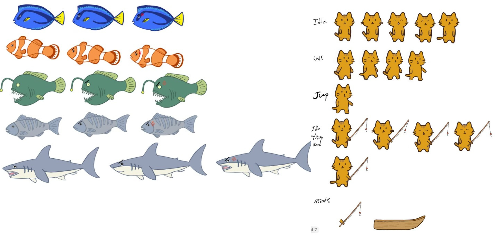
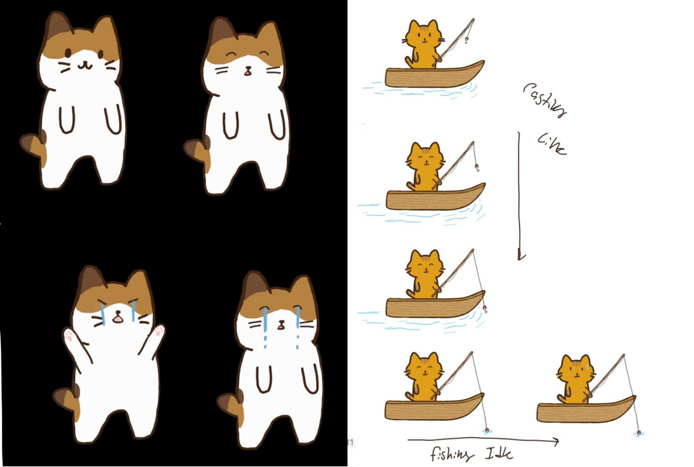
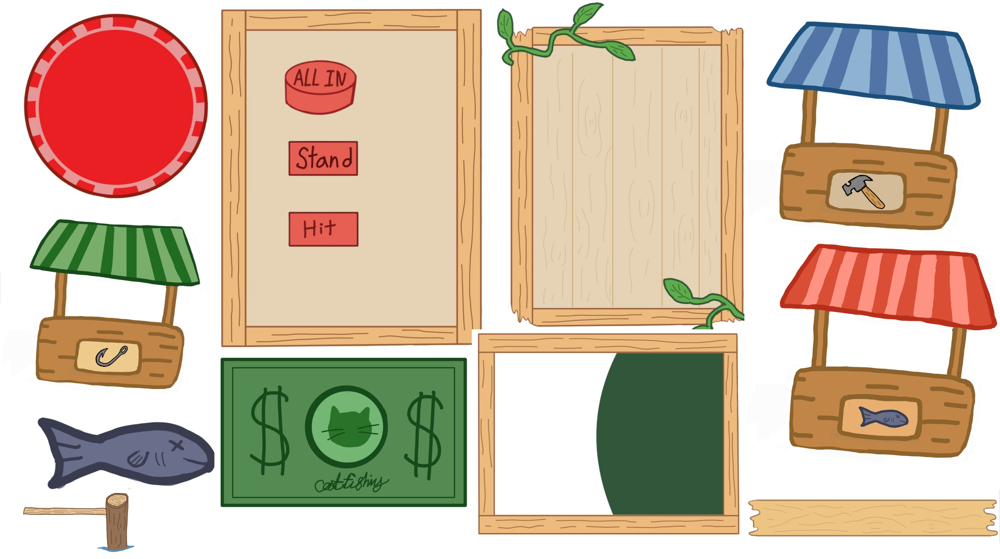
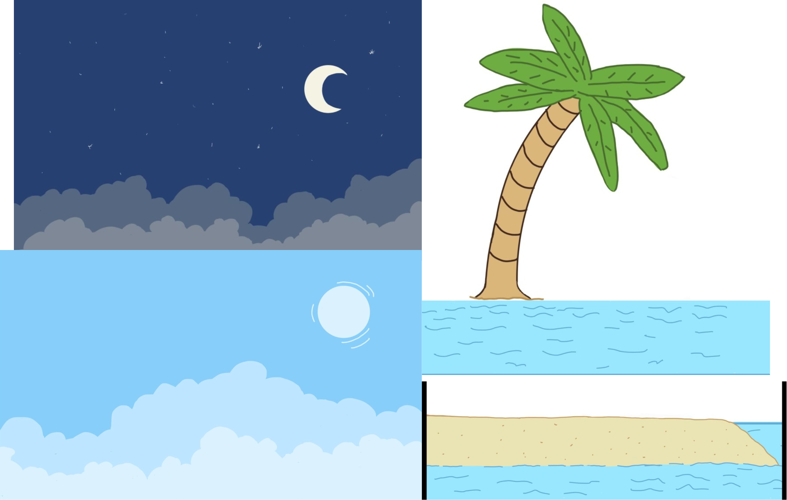

### Sub Role: Audio

In addition to visuals, I handled all audio implementation for the project. I sourced all sound effects (except for the songs Jamie composed) and brought them into Godot. I implemented background music, menu music, and all in-game sound effects. This included:

Walking and jumping

Entering the ocean

Sailing

All mini game interactions: choosing a bet, standing, being dealt a card

Winning a round, losing a round

Winning the game, losing the game

I set up all audio triggers and made sure the game felt reactive, polished, and alive through its sound design.

All audio sourced from: https://pixabay.com/sound-effects/

### Other Contributions:

Debugged and reset up the parralx background.
Implemeted the world builds, like the trees, sand, ocean, set up collison barriers so player can not leave set area, debugged world buld so player can not see outside of intented areas.

Helped schdule and faccliate team meetings to ideate concepts for our game.

Set up presentaation slide and QR code and set up inital game on itch.io, helped debug itch.io publication. 
